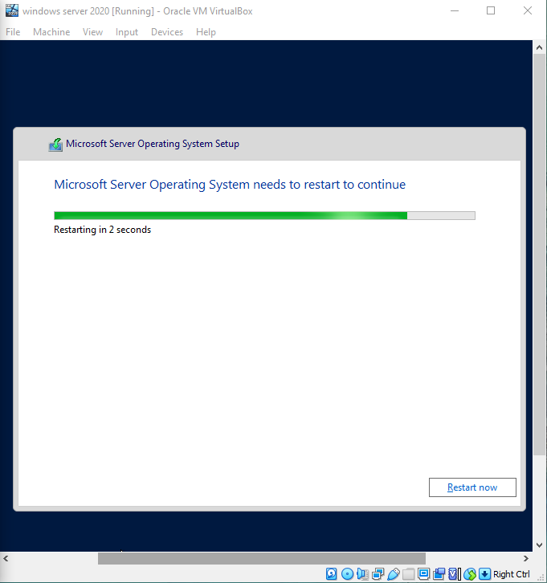

# UTS Sistem Administrasi Server
***
Abdillah Ainur Ridla (1202190060) IT 02-01
***

A. Download ISO Installer windows server 2022

    https://www.microsoft.com/en-us/evalcenter/evaluate-windows-server-2022

- Open VirtualBox and click new

        Enter the name of the machine and type of system to use
            
    
    - Define ram, create the disk defining type and size

    

    

    
    - Go to the machine configuration and in the “Network” section set “Bridge adapter”

    
    - Click on “Start” and select the ISO downloaded

    
    - Click on “Start” and the Windows Server 2022 installation wizard will load

    
    - Click on “Install now"

    
    - Enter the license (if you have on) and then define the edition to use, Accept the license and then proceed with the installation of Windows Server 2022

    

    

    

    
    - The system will reboot to complete the process

    

    
    - Enter the administrator password

    
    - Access the menu “Input – Keyboard – Insert Ctrl + Alt + Del”. Enter the password created and wait for the configuration to load

    

    
    - Run “winver” to validate the installed edition of Windows Server

    

    
B. Instalasi Active Directory Domain Services

    - Before doing the installation, we change the computer name first by going to windows powershell. Then type "rename-computer -Newname Server2022"

         - Open powershell

    
    - Go to the "Server Manager" menu. Then select the “Manage:” option, followed by clicking “Add Roles and Features”. Then click "Next"

    

    
    - Pilih opsi “Role-based or feature-based installation”. Lalu “Next”

    
    - Click Select a server from the server pool to select a local storage directory. Then Next

    
    - Next, put a check mark in the Active Directory Domain Services box. When you check the box, on the right appears a brief description of ADDS and how it works. Then click "Add Features"

    
C. Instalasi DNS server

    - We need to install and configure the Active Directory role and DNS server to work together. Checklist DNS Servers then add features

    
D. Instalasi Net Framework 3.5

    - Checklist ".NET Framework 3.5 features"

    
    - Click Next

    
    - Click Next again

    
    - Select Install

    
    - Install sucsess

    
E. Promote Server to a Domain Controller

    - Setting to static ip using cmd, type sconfig

    

    

    
    - Setting the IP Address Server-ADDS and pointing the DNS to the static IP address used

    
    - Click “Promote this server to a domain controller for ADDS configuration

    
    - Select “Add a new forest” and enter the domain name that will be used in the Root Domain Name. For example here I use the domain "Adi.com"

    
    - Select “Windows Server 2016” at the functional level, put a check mark on “Domain Name System (DNS) server” and “Global Catalog (GC)”. And fill in the Directory Services Restore Mode password with strong password criteria

    
    - Skip the DNS Options section, then click “Next”

    
    - Fill in “The NetBIOS domain name” according to the domain name used

    
    - Skip the Paths section, click “Next”

    
    - Check the configuration specified in the Review Options, if it's ok. Click "Next"

    
    - If there is already written All prerequisite checks passed successfully. Click "Install" to apply the specified configuration

    
    - Wait until the installation process is complete

    
    - After the installation is complete, the laptop will restart automatically. Then login using administrator password

    
    - To check the configuration results, open cmd and type "netdom query fsmo"

    
    - Yuuhuuu sucsess

    

 

    

    

    

        

    

